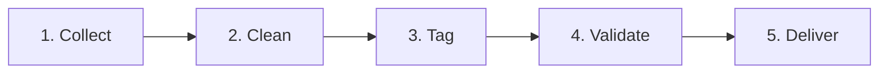

# Lens: Google Photos discovery engine

Lens is an AI discovery engine that reads public feedback about Google Photos search and records, for every post, where the search broke, what failed and what the person still remembered. It was built to find out why people fail to retrieve a photo they remember but cannot precisely describe, before proposing any solution.

**Headline finding:** 8 of 10 failure posts break on the results screen, not while describing the photo.

**Live dashboard and chat:** https://discovery-engine-h9y4.onrender.com

## Why AI

- 3,000 rows are too many to read by hand.
- AI cut the 1,397 cleaned posts to 563 search-related posts to read (60% less).
- The same questions are asked of every post, so posts can be counted and compared.
- Every finding links to a real quote from the post.
- The chat answers new questions with links to the posts behind each answer.

## Dataset

| Stage | Count | What it means |
| --- | ---: | --- |
| Collected | 3,000 | 1,102 user posts and 295 web summaries from 6 public sources, plus 1,603 web-grounded scenarios |
| After cleaning | 1,397 | Rows not written by users removed; every remaining row is unique |
| Search-related | 563 | Posts about finding photos with search |
| Describe a failed search | **524** | 473 first-hand posts and 51 web summaries |

The 1,603 web-grounded scenarios are not posts written by users. They are tagged as scenarios and left out of every count, chart and percentage.

| Source | Posts after cleaning | Failed-search posts |
| --- | ---: | ---: |
| Reddit | 674 | 187 |
| Google Play Store | 336 | 223 |
| Google Photos Community, Help and Blog | 248 | 58 |
| Apple App Store | 78 | 43 |
| YouTube | 30 | 2 |
| Forums and other | 31 | 11 |
| **Total** | **1,397** | **524** |

## Workflow



1. **Collect:** Reddit, Play Store, App Store, Google Photos Community, YouTube and forums.
2. **Clean:** remove posts not written by users and check for duplicates (each of the 1,397 rows has a unique content hash).
3. **Tag:** GPT-4o-mini reads every post and records where it broke, what failed and what was remembered.
4. **Validate:** quotes are checked against the post, and tags must come from fixed lists.
5. **Deliver:** a dashboard of the tagged posts, and a chat that answers with quotes and source links.

## What the AI records for each post

Defined in `src/process/catalog_schema.py` (`CatalogAssessment`):

- **Search relevance:** is the post about finding photos with search (yes, no, unclear)?
- **Issue class:** observed failed search, direct memory problem, search request, successful search, related context, unrelated, unclear, or scenario.
- **Target:** photo, video, screenshot, document or album.
- **Remembered clues:** person, pet, place, event, approximate time, object or scene, visible text, personal context.
- **Forgotten details:** date, place, album, exact words, person or other, only when the post says so explicitly.
- **Search methods:** keyword, person or face, place, date, album, natural language, Ask Photos, browsing or scrolling.
- **Symptoms:** no results, expected photo missing, wrong results, hard to evaluate, can't refine, face grouping, wrong date or place, navigation, search unavailable, slow or error, other.
- **Journey stage:** describing the memory, matching, checking the results, refining the query, or browsing.
- **Quotes:** the exact words behind the issue, the remembered clue, the attempted action and the result.
- **Confidence and a one-line summary.**

## Quality checks

| Check | Where it runs |
| --- | --- |
| Quotes must match the post word for word | `validate_catalog_assessment` aligns every quote to the post text; if the model paraphrased, the quote falls back to the post's exact original text |
| Tags only from fixed lists | Pydantic `Literal` types in `catalog_schema.py` reject any other value |
| Duplicates and source links checked | Each row keeps its row ID, source link and content hash; changed rows are assessed again |
| Tested on hard example posts | `tests/process/test_catalog_assessment.py` (multi-tag posts, praise and requests that must not count as issues, paraphrased quotes, "cannot find" that is not a forgotten detail) |

Assessment `phase1-catalog-v4`, model `gpt-4o-mini`, one pass over all 3,000 rows (3,000 succeeded). No second AI pass was run on this data.

## What AI found

Percentages use the 473 first-hand failure posts and leave out the 51 web summaries.

| Finding | Share | Count |
| --- | ---: | ---: |
| Broke once results appeared (the photo was missing or not recognised) | **81%** | 345 of 426 stage mentions |
| Say the expected photo was missing | 60% | 283 of 473 |
| Broke while describing the photo | 17% | 74 of 426 stage mentions |

What people still remembered in those posts: an object or scene (79), an event (65), a person (55), a place (24) and an approximate time (24).

## Hypotheses to validate

The findings became six hypotheses. Public posts are directional signals, so each one was then tested in user research: 5 interviews with 20 live searches, and a survey of 43 people.

| Hypothesis | What user research showed | Verdict |
| --- | --- | --- |
| H1 · Can't describe it | 19 of 20 described it, by people and occasion rather than the words search matches | Reframed |
| H2 · Search misses clues | 6 of 19 never returned | Partly true |
| H3 · Missed in results | 7 of 13 shown but missed | Validated |
| H4 · A retry rescues it | 2 of 16 failed first tries rescued | Rejected |
| H5 · Start with search | 0 of 5 began there | Rejected |
| H6 · Occasions fail most | 0 of 8 occasion photos found, against 5 of 9 documents and objects | Validated |

## Limits

- Public posts show where people complain, not how often search fails for everyone.
- Counts are posts, not users or search sessions.
- One AI pass with fixed tags; the tags were not all reviewed by a person.

## Run it locally

Install [uv](https://docs.astral.sh/uv/), then:

```bash
git clone https://github.com/Rohit9252/discovery-engine.git
cd discovery-engine
uv sync
```

Create `.env` in the project root:

```env
OPENAI_API_KEY=your_openai_key_here
YOUTUBE_API_KEY=your_youtube_key_here   # only for refreshing YouTube comments
```

Import the 3,000 rows and tag them (resumable; finished rows are reused):

```powershell
uv run python -m src.ingest.phase1_catalog
uv run python -m src.process.catalog_runner
```

Start the dashboard on port 8000, from inside this folder:

```bash
uv run uvicorn src.app.api:app --host 127.0.0.1 --port 8000
```

Or, from any directory, `& 'D:/Product Managment/Graduation Project/discovery-engine/start.ps1'` (add `-Reload` for automatic reload). Open `http://localhost:8000`. `/api/health` reports the app version and the database path.

### Collectors

The collectors refresh raw public feedback and are separate from the tagged dataset above:

```powershell
uv run python -m src.collect.refresh
uv run python -m src.process.clean
uv run python -m src.process.source_audit
```

## Deploy to Render (no recompute on the server)

**Compute once on your machine. Ship results by git push. Render never recomputes.**

- Local work may update `data/processed/reviews.db` and `data/processed/chroma_db/`.
- Commit and push those files with your code.
- Render redeploys and serves the new files as they are.
- Do **not** run scraping, tagging or indexing in the Render build or start commands.

Seed paths (see `src/process/paths.py`): SQLite `data/processed/reviews.db`, Chroma `data/processed/chroma_db/`.

### Create the web service

1. Render dashboard → **New +** → **Web Service** → connect `Rohit9252/discovery-engine`.
2. Settings:

| Field | Value |
| --- | --- |
| Branch | `main` |
| Runtime | Python 3 |
| Build Command | `pip install -r requirements.txt` |
| Start Command | `uvicorn src.app.api:app --host 0.0.0.0 --port $PORT` |
| Auto-Deploy | On |

3. Environment: add `OPENAI_API_KEY` (required for the chat) and `PYTHON_VERSION=3.11.9`.
4. Deploy, open the Render URL, and check that the overview loads and the chat answers a question.

`app-store-scraper` is left out of `requirements.txt` because it pins an old `requests` version; it is only needed for local collection (`uv sync` installs it from `pyproject.toml`).

### Later updates

1. Finish any heavy processing locally (skip for code-only changes).
2. Commit the code and, if the data changed, the updated `reviews.db` and `chroma_db`.
3. Push to `main`. Render redeploys without recomputing.

## Tech stack

| Layer | Technology |
| --- | --- |
| Tagging and chat | OpenAI `gpt-4o-mini` through LangChain |
| Schemas and validation | Pydantic |
| Data | SQLite, Pandas |
| API | FastAPI |
| Dashboard | Vanilla JS and Chart.js |
| Packages | uv |

## Project structure

```text
discovery-engine/
├── data/
│   ├── processed/         # reviews.db (posts and AI tags) and Chroma files
│   └── raw/               # collector outputs
├── src/
│   ├── app/               # FastAPI app and the dashboard (HTML, JS, CSS)
│   ├── collect/           # collectors for Reddit, Play Store, App Store, YouTube and forums
│   ├── ingest/            # imports the 3,000-row dataset with its evidence types
│   └── process/           # cleaning, tagging schema and runner, dashboard data, chat
├── tests/                 # collector, import, tagging and API tests
├── pyproject.toml
└── README.md
```
