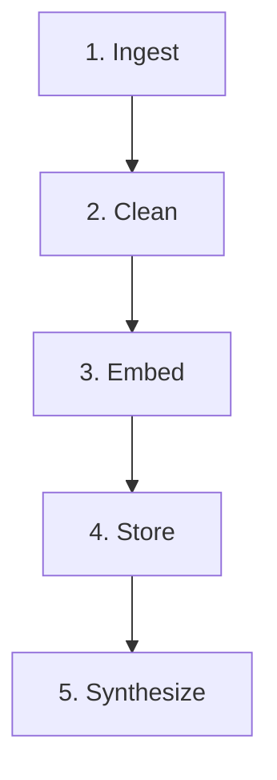

# Lens - Google Photos Discovery Engine

Lens is an AI-powered product management research tool designed to analyze and synthesize qualitative user feedback regarding search and retrieval failures in Google Photos.

## Context & Why It Was Built

In 2024, Google launched "Ask Photos," a Gemini-powered natural language search feature. It faced latency and quality issues, resulting in a toggle to revert to "classic" search being introduced in 2026. Despite the feature, active Reddit threads and reviews consistently point to failures in retrieving old or poorly tagged photos. 

Instead of treating conversational AI as a silver bullet, Lens was built to extract **why** search fails. It automatically scrapes, cleans, and synthesizes hundreds of real user complaints to identify specific failure stages (Execution, Post-Execution, Discovery) and surface actionable product opportunities based on the pain points.

## Architecture Pipeline

The system operates on a 5-stage autonomous data pipeline:


1. **Ingest:** Scrape Reddit, YouTube, and App Stores for user complaints.
2. **Clean:** Normalize schemas, deduplicate, and store in SQLite.
3. **Embed:** Use LLM to extract failure stages and generate vector embeddings.
4. **Store:** Save vectorized representations in ChromaDB.
5. **Synthesize:** LangGraph Corrective-RAG agent retrieves relevant evidence and generates structured PM insights.

## Data Sources

The refreshed database preserves **1,869 feedback records**. The dashboard and semantic search expose **1,731 source-scoped records**, with **138 historical Reddit records excluded pending product-context review**. This is not a count of confirmed retrieval failures.

| Source | Available records |
| --- | ---: |
| Play Store | 1,076 |
| Reddit | 475 |
| App Store | 107 |
| YouTube | 73 |

Source receipts, exclusions, and limitations are documented in `../Docs/discovery-engine-collection-audit.md`.


## Tech Stack

| Layer | Technology | Purpose |
| :--- | :--- | :--- |
| **Backend API** | FastAPI | High-performance Python async API |
| **AI Agent** | LangGraph + OpenAI | Corrective-RAG orchestration and synthesis (`gpt-4o-mini`) |
| **Vector DB** | ChromaDB | Semantic search and embedding storage |
| **Relational DB** | SQLite | Raw data storage and deduplication |
| **Frontend** | Vanilla JS + Chart.js | Dynamic, reactive dashboard UI |
| **Package Manager** | uv | Extremely fast Python dependency management |

## Local Setup

### 1. Clone & Install
Ensure you have [uv](https://docs.astral.sh/uv/) installed.
```bash
git clone https://github.com/Rohit9252/discovery-engine.git
cd discovery-engine
uv sync
```

### 2. Environment Variables
Create a `.env` file in the root directory:
```env
OPENAI_API_KEY=your_openai_key_here
YOUTUBE_API_KEY=your_youtube_key_here
```

### 3. Refresh public feedback and semantic search

```powershell
uv run python -m src.collect.refresh
uv run python -m src.process.clean
uv run python -m src.process.source_audit
uv run python -m src.process.index_feedback
```

Alternatively run `run_pipeline.bat`. Raw merges preserve prior evidence; inspect `data/collection-runs/latest-summary.json` for source errors or partial coverage. Semantic indexing of raw feedback does not perform or validate memory-specific AI extraction.

### 4. Start the Dashboard on port 8000
```bash
uv run uvicorn src.app.api:app --host 127.0.0.1 --port 8000
```
Run that command inside `D:\Product Managment\Graduation Project\discovery-engine`, not the graduation project root. `uv run uv` starts the uv package manager again; `uv run uvicorn` starts the web server.

From any directory, the included PowerShell launcher selects the correct project directory:
```powershell
& 'D:/Product Managment/Graduation Project/discovery-engine/start.ps1'
# Optional automatic source reload:
& 'D:/Product Managment/Graduation Project/discovery-engine/start.ps1' -Reload
```

Open `http://localhost:8000` in your browser. Stop a foreground server with Ctrl+C before starting another copy. The launcher stays on port 8000 and reports a collision instead of silently choosing another port. `/api/health` reports the app version and absolute database path.

Before analysis, dashboard topics are provisional keyword matches. After analysis, cards and charts use saved source-grounded AI assessments. They count feedback records, not users or sessions, and do not establish severity, abandonment rates or search success rates. Missing storage and API errors display explicit unavailable states.

## Deploy to Render (no recompute on the server)

### Standing rule

**Compute once on your machine. Ship results by git push. Render never recomputes.**

- Local work may update `data/processed/reviews.db` and `data/processed/chroma_db/`.
- Commit and push those artifacts with your code.
- Render redeploys and serves the new files as-is.
- Do **not** run scrape, extract, catalog/issue runners, or `index_feedback` in Render build/start. Ever.

Seed paths (see `src/process/paths.py`):

- SQLite: `data/processed/reviews.db`
- Chroma: `data/processed/chroma_db/`

### What you need

1. GitHub access to this repo
2. A [Render](https://render.com) account (GitHub signup is fine)
3. `OPENAI_API_KEY` for live Chat (set only in Render Environment, never commit `.env`)

You do **not** need YouTube/Gemini keys, Persistent Disk, Postgres, or Redis for Overview + Chat.

### Create the Web Service

1. Dashboard → **New +** → **Web Service** → connect `Rohit9252/discovery-engine`.
2. Settings:

| Field | Value |
| --- | --- |
| Branch | `main` |
| Runtime | Python 3 |
| Build Command | `pip install -r requirements-render.txt` |
| Start Command | `uvicorn src.app.api:app --host 0.0.0.0 --port $PORT` |
| Auto-Deploy | On |

`Procfile` and `render.yaml` target **`main` only**.

**Important:** In the Render dashboard, set Build Command to `pip install -r requirements-render.txt` (not `requirements.txt`). The full `requirements.txt` includes `app-store-scraper`, which demands an old `requests` version and breaks Render's pip resolver. `requirements-render.txt` is the web/chat runtime only - collectors stay local. Seed data (`reviews.db` + `chroma_db`) is already on `main` and deploys with the code automatically.

3. Environment → add `OPENAI_API_KEY` (required). Optional: `PYTHON_VERSION=3.11.9`.
4. Deploy, open the Render URL, confirm Overview stats load and Chat answers a question.

### Future updates (2 days later or whenever)

1. Finish any heavy processing **locally** (or skip if UI/code only).
2. Commit code and, if data changed, updated `reviews.db` + `chroma_db`.
3. Push to the branch Render watches.
4. Render auto-redeploys. **No recomputation on Render.**

## Retrieval research

Run the resumable research workflow separately from collection:

```powershell
uv run python -m src.process.research_pipeline
```

This command uses the existing OpenAI API configuration for a corpus-wide first pass, a stronger assessment of retrieval candidates and possible missed matches, bounded retries, and an evidence report export. Successful current assessments are reused. Findings remain saved across server restarts; dashboard refreshes do not make extraction API calls.

The Retrieval Evidence Review section shows original feedback, source links, remembered clues, explicitly missing details, attempted searches and actual workarounds. Unstated information remains not reported. AI analysis complete means all available records were assessed; it does not mean human validation. Methodology, verification and screenshots: `../Docs/discovery-engine-retrieval-analysis.md`.

## Project Structure

```text
discovery-engine/
├── data/
│   ├── processed/         # SQLite DB and ChromaDB vector files
│   └── raw/               # JSON outputs from collectors
├── src/
│   ├── app/               # FastAPI backend and static HTML/JS/CSS frontend
│   ├── collect/           # Python scraping scripts for Reddit, YouTube, Play Store
│   └── process/           # Cleaning pipeline, DB schemas, LLM extraction, LangGraph agent
├── .env                   # API keys
├── pyproject.toml         # Dependencies managed by uv
└── README.md              # Project documentation
```
