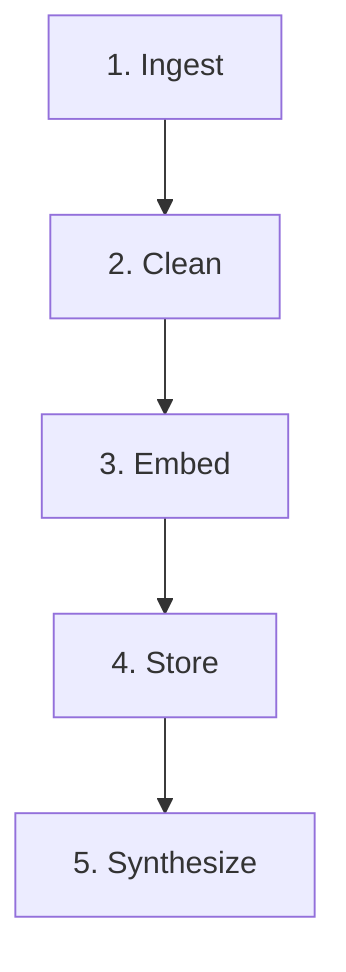

# Lens - Google Photos Discovery Engine

Lens is an AI-powered product management research tool designed to analyze and synthesize qualitative user feedback regarding search and retrieval failures in Google Photos.

## Context & Why It Was Built

In 2024, Google launched "Ask Photos," a Gemini-powered natural language search feature. It faced latency and quality issues, resulting in a toggle to revert to "classic" search being introduced in 2026. Despite the feature, active Reddit threads and reviews consistently point to failures in retrieving old or poorly tagged photos. 

Instead of treating conversational AI as a silver bullet, Lens was built to extract **why** search fails. It automatically scrapes, cleans, and synthesizes hundreds of real user complaints to identify specific failure stages (Execution, Post-Execution, Discovery) and surface actionable product opportunities based on the pain points.

## Architecture Pipeline

The system operates on a 5-stage autonomous data pipeline:


1. **Ingest:** Scrape Reddit, YouTube, and App Stores for user complaints.
2. **Clean:** Normalize schemas, deduplicate, and store in SQLite.
3. **Embed:** Use LLM to extract failure stages and generate vector embeddings.
4. **Store:** Save vectorized representations in ChromaDB.
5. **Synthesize:** LangGraph Corrective-RAG agent retrieves relevant evidence and generates structured PM insights.

## Data Sources

Our database contains **848** verified user reviews detailing discovery and retrieval failures across three primary platforms:

| Source | Count | Description |
| :--- | :--- | :--- |
| **Reddit** | 666 | Deep-dive complaints and workarounds (r/googlephotos, r/GooglePixel, etc.) |
| **YouTube** | 97 | Tutorial comments highlighting UI/UX learning curves |
| **Play Store** | 85 | Direct Android app reviews |

*(Note: Apple App Store reviews are currently unsupported due to API blocking, but the architecture supports ingesting them if a third-party scraper is provided).*

## Tech Stack

| Layer | Technology | Purpose |
| :--- | :--- | :--- |
| **Backend API** | FastAPI | High-performance Python async API |
| **AI Agent** | LangGraph + OpenAI | Corrective-RAG orchestration and synthesis (`gpt-4o-mini`) |
| **Vector DB** | ChromaDB | Semantic search and embedding storage |
| **Relational DB** | SQLite | Raw data storage and deduplication |
| **Frontend** | Vanilla JS + Chart.js | Dynamic, reactive dashboard UI |
| **Package Manager** | uv | Extremely fast Python dependency management |

## Local Setup

### 1. Clone & Install
Ensure you have [uv](https://docs.astral.sh/uv/) installed.
```bash
git clone https://github.com/Rohit9252/discovery-engine.git
cd discovery-engine
uv sync
```

### 2. Environment Variables
Create a `.env` file in the root directory:
```env
OPENAI_API_KEY=your_openai_key_here
YOUTUBE_API_KEY=your_youtube_key_here
```

### 3. Run the Pipeline
Execute the data pipeline sequentially:
```bash
# 1. Collect Data
uv run python src/collect/reddit.py
uv run python src/collect/youtube.py
uv run python src/collect/play_store.py

# 2. Clean & Store in SQLite
uv run python src/process/clean.py

# 3. Extract Insights & Vectorize (ChromaDB)
uv run python src/process/run_extraction.py --reset
```

### 4. Start the Dashboard
```bash
uv run uvicorn src.app.api:app --port 8000
```
Open `http://localhost:8000` in your browser.

## Project Structure

```text
discovery-engine/
├── data/
│   ├── processed/         # SQLite DB and ChromaDB vector files
│   └── raw/               # JSON outputs from collectors
├── src/
│   ├── app/               # FastAPI backend and static HTML/JS/CSS frontend
│   ├── collect/           # Python scraping scripts for Reddit, YouTube, Play Store
│   └── process/           # Cleaning pipeline, DB schemas, LLM extraction, LangGraph agent
├── .env                   # API keys
├── pyproject.toml         # Dependencies managed by uv
└── README.md              # Project documentation
```
